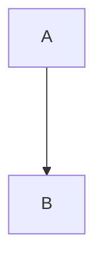
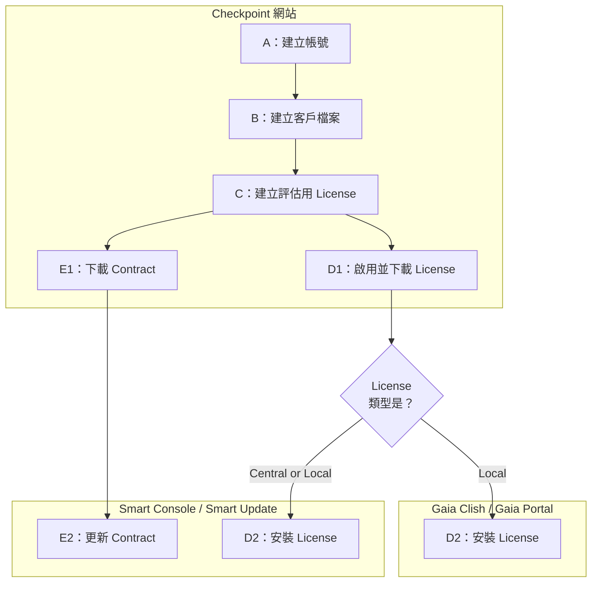

# Checkpoint 





## A：建立 Checkpoint 帳號

1.  [進入 Checkpoint 官網](https://www.checkpoint.com/)
    
2.  Sign in > Sign up Now
    
    
    
3.  填寫資料註冊帳號

<div style="page-break-after: always;"></div>

## B：建立客戶檔案 (Accounts)

Account 是帳號的意思，然而在這裡的「帳號」指的是客戶檔案，而非 Checkpoint 帳號

由於每個試用 License 都必須綁定客戶，因此必須至少確保有一個客戶檔案才能申請 License

1.  登入 [Checkpoint User Center](https://usercenter.checkpoint.com/)
    
2.  ASSETS / INFO > MY ACCOUNTS: My Accounts > `Create Account`
    
    
	
3.  填入資料來建立客戶檔案
    
    -   [郵局 - 地址英譯](https://www.post.gov.tw/post/internet/Postal/index.jsp?ID=207)

<div style="page-break-after: always;"></div>

## C：建立評估用 License

每台 Security Gateway 都會需要一個 License，請依需求數量建立 License

1.  登入 [Checkpoint User Center](https://usercenter.checkpoint.com/)
    
2.  建立評估用 License
    
    ASSETS / INFO > MY ACCOUNTS: Product Center > Evaluations [Tab] > 🔽`Product Evaluation`
    
    
    
3.  依據需求填寫申請 License 相關資料
    
    
    
4.  完成
        
	

<div style="page-break-after: always;"></div>

## D1：啟用並下載 License

License 剛建立完成，並還沒有直接啟用，必須先啟用並為 License 綁定模式與 IP。

1.  進入 License 設定介面
    
    ASSETS / INFO > MY ACCOUNTS: Product Center > Evaluations [Tab] > Details [Toggle] > [勾選剛建立的 License] > 🔧`License`
	
	>   💡 未來如果需要修改 License，也是由這個路徑進入
    
    
        
2.  設定 License 模式
    
    >   💡 [Type of License](https://supportcenter.checkpoint.com/supportcenter/portal?eventSubmit_doGoviewsolutiondetails=&solutionid=sk62685)
    >   -   Central：須設定 SMS IP ，該 License 就能附加到任意設備。只能以集中管理的方式安裝 License。Checkpoint 建議使用 Central 
    >   -   Local：須設定該設備的 IP ，這意味著 License 將只能用在指定設備上
    >   
    >   更詳細比較請參考 D2
        
    
    
3.  取得 License
    
	-   下載 License 檔案
	
	    +   <位置 1> 你的信箱

            
	    
	    +   <位置 2> 前一步驟結束後，可立即下載
        
            
    
        +   <位置 3> ASSETS / INFO > MY ACCOUNTS: Product Center > Evaluations [Tab] > Details [Toggle] > [點擊 License] > License Information [Tab] > `Get Last License` > `Get License File`
            
            
            
            
            
            
    
    -   取得 License 指令

        +   <位置 1> 你的信箱
        
        +   <位置 2> ASSETS / INFO > MY ACCOUNTS: Product Center > Evaluations [Tab] > Details [Toggle] > [勾選剛建立的 License] > 🔧`License Instructions`
        
            
        
        +   找到的內容長這樣
        
            ```plaintext
            Command line instructions for License Installation
            --------------------------------------------------
            On all platforms and operating systems available for this product:
            Install license(s) from the Security Management server.

            For the Security Management Server:
            Run 'cplic put 192.168.2.101 16Feb2022 aurMSEkYK-gjWDweaG7-EqCj2fSCV-u8ALBPGei CPSM-C-U CPSB-NPM CPSB-EPM CPSB-LOGS CPSB-MNTR CPSB-PRVS CPSB-UDIR CPSB-WKFL-100 CPSB-WS CPSB-MPTL CPVP-SNX-U-NGX CPSB-SWB CPSB-ADNC-M CPSB-RPRT-U CPSB-EVCR-U CPSB-SSLVPN-MOBMAIL+5000 CPSB-COMP-150 CK-481D6E8DC81C'

            Validation Code: TLATZ

            For the Security Gateway:
            Run 'cplic put [module name] 192.168.2.101 16Feb2022 dSymHjefM-rSCWWvzej-8v84sp2Ai-yn7xHh98v CPSG-C-8-U CPSB-FW CPSB-VPN CPSB-IPSA CPSB-DLP CPSB-SSLVPN-U CPSB-IA CPSB-ADNC CPSG-VSX-25S CPSB-SWB CPSB-IPS CPSB-AV CPSB-URLF CPSB-ASPM CPSB-APCL CPSB-ABOT CPSB-CTNT CK-481D6E8DC81C'
            *When using SmartConsole for license installation, remove '[module name]' section and apply license directly to the Security Gateway


            Validation Code: tPjaY
            ```
            
            

<div style="page-break-after: always;"></div>

## D2：安裝 License

>   💡 先確認 License 在兩種模式下的限制吧！
>   
>   |  | Central License | Local License |
>   | --- | --- | --- |
>   | 安裝到<br>SMS<br>的方法 | ✔️ SC / SU 集中管理*<br>✔️ Gaia Portal<br>✔️ Gaia Clish (Expert) | ✔️ SC / SU 集中管理*<br>✔️ Gaia Portal<br>✔️ Gaia Clish (Expert) |
>   | 安裝到<br>SGW (FW)<br>的方法 | ✔️ SC / SU 集中管理*<br>❌ Gaia Portal<br>❌ Gaia Clish (Expert) | ✔️ SC / SU 集中管理*<br>✔️ Gaia Portal<br>✔️ Gaia Clish (Expert) |
>   | IP 設定 | ● License IP 為 SMS 的 IP<br>● 所有 License 共用一個 IP<br>● 因共用 IP，License 可轉移<br>● 只能集中安裝 (除 IP 相同的 SMS) | ● License IP 為指定設備的 IP<br>● License 須分別設定各自 IP<br>● 因 IP 不同，License 難轉移<br>● License 與設備 IP 必須相同
>   | SC / SU 集中管理<br>匯入 License 時 | 系統將 License 匯入 License Repository | 系統依據 IP 自動附加到設備上 |
>   
>   \* SC / SU 集中管理：R80.40T? 以上的 Smart Console [R81+]、R80.40 以下的 Smart Update

### Smart Update (<=R80.40)

1.  進入 Smart Update
    
    Smart Console > ≡ Menu > Manage licenses and packages

    
    
2.  檢視調整，方便後續步驟
    
	1.  切換到 Licenses & Contracts 分頁
    
    2.  ≡ Launch Menu > <ins>L</ins>icenses & Contracts > <ins>V</ins>iew Repository
	
    

3.  匯入 License

    -   <法一> 工具列 > [選擇匯入方法]
    
    -   <法二> ≡ Launch Menu > <ins>L</ins>icenses & Contracts > <ins>A</ins>dd License > [選擇匯入方法]
    
    
	
    >   💡 所謂 Manually 或 License String，是指去安裝指令中的參數部分，例如：
    >   
    >   ```
    >   192.168.2.101 16Feb2022 aurMSEkYK-gjWDweaG7-EqCj2fSCV-u8ALBPGei CPSM-C-U CPSB-NPM CPSB-EPM CPSB-LOGS CPSB-MNTR CPSB-PRVS CPSB-UDIR CPSB-WKFL-100 CPSB-WS CPSB-MPTL CPVP-SNX-U-NGX CPSB-SWB CPSB-ADNC-M CPSB-RPRT-U CPSB-EVCR-U CPSB-SSLVPN-MOBMAIL+5000 CPSB-COMP-150 CK-481D6E8DC81C
    >   ```
    
4.  安裝 License
    
    -   <法一> Licenses & Contracts [Tab] > [選擇設備] > (右鍵) Attach Licenses... > [選擇 License]
    
    -   <法二> Licenses and Contracts Repository [Panel] > [選擇 License] > (右鍵) Attach Licenses... > [選擇設備]
    
    

### Smart Console (>=R80.40 T?)

GATEWAYS & SERVERS > [選擇設備] > Licenses [Tab] > `Add` > [選擇 匯入/安裝 方法]


>   💡 所謂 Manually 或 License String，是指去安裝指令中的參數部分，例如：
>   
>   ```
>   192.168.2.101 16Feb2022 aurMSEkYK-gjWDweaG7-EqCj2fSCV-u8ALBPGei CPSM-C-U CPSB-NPM CPSB-EPM CPSB-LOGS CPSB-MNTR CPSB-PRVS CPSB-UDIR CPSB-WKFL-100 CPSB-WS CPSB-MPTL CPVP-SNX-U-NGX CPSB-SWB CPSB-ADNC-M CPSB-RPRT-U CPSB-EVCR-U CPSB-SSLVPN-MOBMAIL+5000 CPSB-COMP-150 CK-481D6E8DC81C
>   ```

### Gaia Clish (Expert)

1.  請使用 D1-3 的「取得 License 指令」來取得安裝 License 的指令
    
2.  在指定設備執行安裝 License

### Gaia Portal

 ## 參考資料

-   [How to Install a License](https://supportcenter.checkpoint.com/supportcenter/portal?eventSubmit_doGoviewsolutiondetails=&solutionid=sk81200)
    
-   [Managing and Installing license via SmartUpdate](https://supportcenter.checkpoint.com/supportcenter/portal?eventSubmit_doGoviewsolutiondetails=&solutionid=sk98529)

